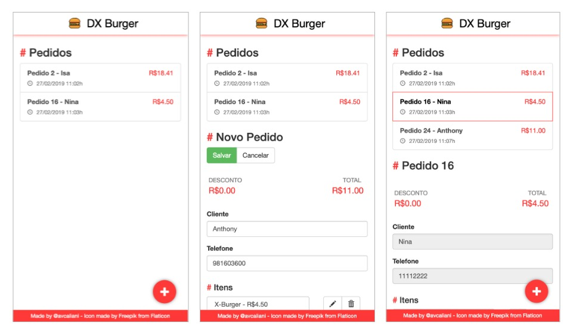

# 🍔 DX Burger Web
By Anthony Vilarim Caliani

[](#) [](#) [](#) [](#)

## Quick Start
Before you run this application you must have installed the following softwares in your machine:
 - Node.js
 - npm
 - Ng CLI
 - Docker

First run `npm install` and then if everything is ok, you just need to run `sh run.sh build-start` and enjoy it 🙂

## Project Map
```
dx-burger-web/
├── DockerFile
├── README.md
├── angular.json
├── e2e
│   ├── protractor.conf.js
│   ├── src
│   │   ├── app.e2e-spec.ts
│   │   └── app.po.ts
│   └── tsconfig.e2e.json
├── nginx.conf
├── package-lock.json
├── package.json
├── run.sh
├── src
│   ├── app
│   │   ├── app-routing.module.ts
│   │   ├── app.component.html
│   │   ├── app.component.scss
│   │   ├── app.component.ts
│   │   ├── app.module.ts
│   │   ├── common
│   │   │   ├── footer
│   │   │   │   ├── footer.component.html
│   │   │   │   ├── footer.component.scss
│   │   │   │   └── footer.component.ts
│   │   │   ├── header
│   │   │   │   ├── header.component.html
│   │   │   │   ├── header.component.scss
│   │   │   │   └── header.component.ts
│   │   │   └── response.model.ts
│   │   └── order
│   │       ├── order-edit
│   │       │   ├── burger-ingredients
│   │       │   │   ├── burger-ingredients.component.html
│   │       │   │   └── burger-ingredients.component.ts
│   │       │   ├── order-edit.component.html
│   │       │   ├── order-edit.component.scss
│   │       │   ├── order-edit.component.ts
│   │       │   └── order-edit.resolver.ts
│   │       ├── order-empty
│   │       │   └── order-empty.component.ts
│   │       ├── order-list
│   │       │   ├── order-list.component.html
│   │       │   ├── order-list.component.scss
│   │       │   └── order-list.component.ts
│   │       ├── order.model.ts
│   │       └── order.service.ts
│   ├── assets
│   │   └── img
│   │       ├── loader.svg
│   │       └── logo.svg
│   ├── browserslist
│   ├── environments
│   │   ├── environment.prod.ts
│   │   └── environment.ts
│   ├── favicon.ico
│   ├── index.html
│   ├── karma.conf.js
│   ├── main.ts
│   ├── polyfills.ts
│   ├── styles.scss
│   ├── test.ts
│   ├── tsconfig.app.json
│   ├── tsconfig.spec.json
│   └── tslint.json
├── tsconfig.json
└── tslint.json
```

## Screenshots


---

_You can find [@avcaliani](#) at [GitHub](https://github.com/avcaliani) or [GitLab](https://gitlab.com/avcaliani)._
